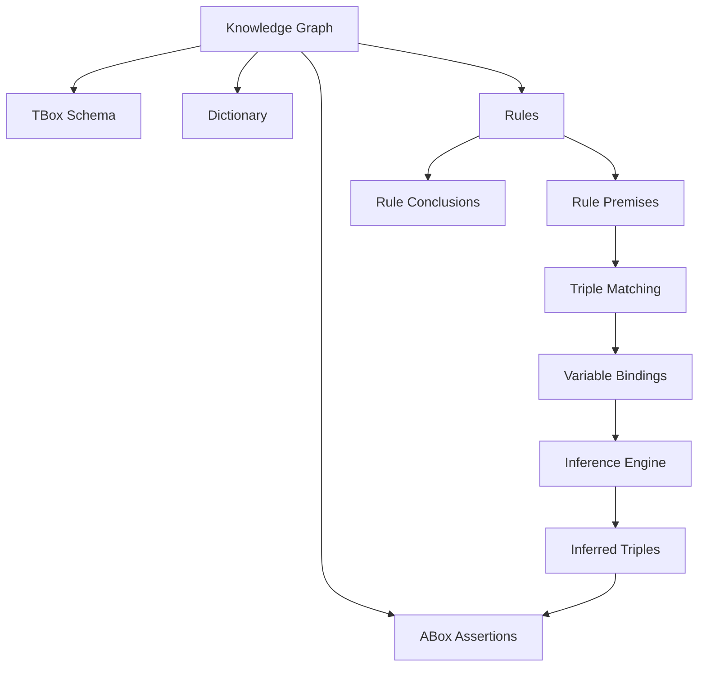
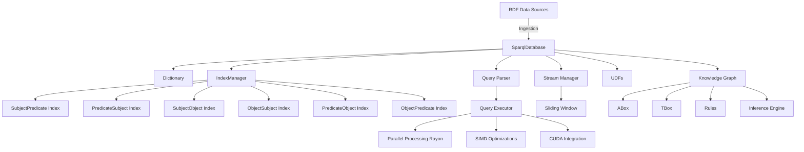
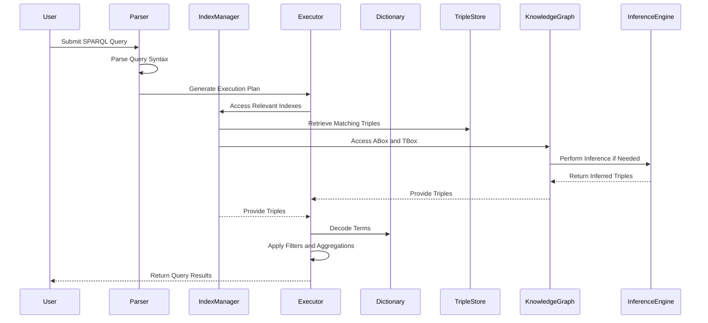
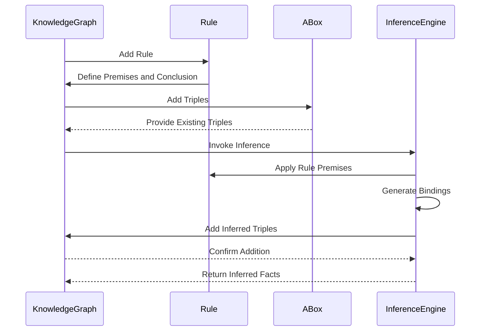

# Knowledge Graph Management

## Table of Contents

1. [Introduction](#introduction)
2. [ABox and TBox](#abox-and-tbox)
    - [ABox (Assertional Box)](#abox-assertional-box)
    - [TBox (Terminological Box)](#tbox-terminological-box)
3. [Triple Patterns and Terms](#triple-patterns-and-terms)
    - [Term Enum](#term-enum)
    - [TriplePattern Type](#triplepattern-type)
4. [Rule-Based Inference](#rule-based-inference)
    - [Rule Struct](#rule-struct)
5. [KnowledgeGraph Struct](#knowledgegraph-struct)
6. [Core Functionalities](#core-functionalities)
    - [Adding TBox and ABox Triples](#adding-tbox-and-abox-triples)
    - [Querying ABox and TBox](#querying-abox-and-tbox)
    - [Rule Management and Inference](#rule-management-and-inference)
7. [Backward Chaining](#backward-chaining)
    - [Backward Chaining Methods](#backward-chaining-methods)
    - [Helper Functions](#helper-functions)
8. [Mermaid Diagram: Knowledge Graph and Inference](#mermaid-diagram-knowledge-graph-and-inference)
9. [Example Usage](#example-usage)
    - [Knowledge Graph Inference Example](#knowledge-graph-inference-example)
        - [Step 1: Initialize the Knowledge Graph](#step-1-initialize-the-knowledge-graph)
        - [Step 2: Define and Add a Rule](#step-2-define-and-add-a-rule)
        - [Step 3: Perform Inference](#step-3-perform-inference)
10. [Diagrams](#diagrams)
    - [System Architecture Diagram](#system-architecture-diagram)
    - [Query Execution Flow](#query-execution-flow)
    - [Knowledge Graph Inference Flow](#knowledge-graph-inference-flow)
11. [Appendices](#appendices)
    - [Glossary](#glossary)
    - [Further Reading](#further-reading)

---

## Introduction

The **Knowledge Graph** module is a pivotal component of the Kolibrie Database Engine, enabling the representation, querying, and inference of knowledge through structured triples. This section provides a detailed overview of the Knowledge Graph's architecture, its fundamental concepts, and the mechanisms employed to facilitate sophisticated knowledge representation and reasoning.

### ABox and TBox

In the realm of knowledge representation, the **ABox** (Assertional Box) and **TBox** (Terminological Box) are fundamental constructs derived from Description Logics. They serve distinct yet complementary roles within the Knowledge Graph.

- **ABox (Assertional Box)**: Contains assertions about individuals, representing specific instances and their relationships. These are concrete data points that embody the factual knowledge within the graph.

    ```rust
    pub abox: BTreeSet<Triple>, // ABox: Assertions about individuals (instances)
    ```

- **TBox (Terminological Box)**: Encapsulates the schema-level information, defining concepts (classes) and relationships (properties) that govern the structure of the knowledge. It establishes the ontology that provides semantic context to the ABox.

    ```rust
    pub tbox: BTreeSet<Triple>, // TBox: Concepts and relationships (schema)
    ```

### Triple Patterns and Terms

To facilitate flexible and expressive querying, the Knowledge Graph utilizes **Triple Patterns** and a robust **Term** representation.

#### Term Enum

The `Term` enum distinguishes between variables and constants within triple patterns, enabling pattern matching and variable bindings during query execution.

```rust
#[derive(Debug, Clone, PartialEq, Eq, PartialOrd, Ord)]
pub enum Term {
    Variable(String),
    Constant(u32),
}
```

- **Variable**: Represents a placeholder that can be bound to different constants during pattern matching.
- **Constant**: Encapsulates encoded string terms (using the `Dictionary`) that correspond to specific subjects, predicates, or objects.

#### TriplePattern Type

A `TriplePattern` is a tuple of three `Term` instances, representing the subject, predicate, and object of a pattern within queries or rules.

```rust
pub type TriplePattern = (Term, Term, Term);
```

### Rule-Based Inference

The Knowledge Graph supports **Rule-Based Inference**, allowing the derivation of new knowledge based on predefined rules. This mechanism enhances the graph's capability to infer implicit knowledge from explicit assertions.

#### Rule Struct

A `Rule` comprises a set of premise patterns and a conclusion pattern. When the premises are satisfied by existing triples, the conclusion is inferred and added to the ABox.

```rust
#[derive(Debug, Clone)]
pub struct Rule {
    pub premise: Vec<TriplePattern>,
    pub conclusion: TriplePattern,
}
```

- **Premise**: A vector of `TriplePattern` instances that must be matched against the ABox.
- **Conclusion**: A single `TriplePattern` that is inferred when the premises are satisfied.

### KnowledgeGraph Struct

The `KnowledgeGraph` struct encapsulates the ABox, TBox, dictionary, and a collection of dynamic rules. It provides methods to manage triples, add rules, and perform inference.

```rust
#[derive(Debug, Clone)]
pub struct KnowledgeGraph {
    pub abox: BTreeSet<Triple>, // ABox: Assertions about individuals (instances)
    pub tbox: BTreeSet<Triple>, // TBox: Concepts and relationships (schema)
    pub dictionary: Dictionary,
    pub rules: Vec<Rule>, // List of dynamic rules
}
```

### Core Functionalities

#### Adding TBox and ABox Triples

The Knowledge Graph allows the addition of triples to both the TBox and ABox, facilitating the construction of the schema and the assertion of specific facts.

```rust
/// Add a TBox triple (schema-level information)
pub fn add_tbox_triple(&mut self, subject: &str, predicate: &str, object: &str)

/// Add an ABox triple (instance-level information)
pub fn add_abox_triple(&mut self, subject: &str, predicate: &str, object: &str)
```

- **Usage Example**:

    ```rust
    let mut kg = KnowledgeGraph::new();
    kg.add_tbox_triple("Person", "rdfs:subClassOf", "Agent");
    kg.add_abox_triple("Alice", "rdf:type", "Person");
    ```

#### Querying ABox and TBox

The Knowledge Graph provides methods to query triples from both the ABox and TBox based on optional subject, predicate, and object criteria.

```rust
/// Query the ABox for instance-level assertions
pub fn query_abox(
    &mut self,
    subject: Option<&str>,
    predicate: Option<&str>,
    object: Option<&str>,
) -> Vec<Triple>

/// Query the TBox for schema-level assertions
pub fn query_tbox(
    &mut self,
    subject: Option<&str>,
    predicate: Option<&str>,
    object: Option<&str>,
) -> Vec<Triple>
```

- **Usage Example**:

    ```rust
    let results = kg.query_abox(Some("Alice"), Some("rdf:type"), None);
    ```

#### Rule Management and Inference

Dynamic rules can be added to the Knowledge Graph, enabling the system to infer new triples based on existing data.

```rust
/// Add a dynamic rule to the graph
pub fn add_rule(&mut self, rule: Rule)

/// Infer new facts based on dynamic rules
pub fn infer_new_facts(&mut self) -> Vec<Triple>
```

- **Adding a Rule Example**:

    ```rust
    let rule = Rule {
        premise: vec![
            (
                Term::Variable("x".to_string()),
                Term::Constant(kg.dictionary.encode("rdf:type")),
                Term::Constant(kg.dictionary.encode("Person")),
            ),
        ],
        conclusion: (
            Term::Variable("x".to_string()),
            Term::Constant(kg.dictionary.encode("isHuman")),
            Term::Constant(kg.dictionary.encode("true")),
        ),
    };
    kg.add_rule(rule);
    ```

- **Performing Inference**:

    ```rust
    let inferred = kg.infer_new_facts();
    ```

### Backward Chaining

The Knowledge Graph implements **Backward Chaining**, a reasoning technique where the system starts with a goal (query) and works backward to determine if the goal can be satisfied by existing data and rules.

#### Backward Chaining Methods

```rust
pub fn backward_chaining(&self, query: &TriplePattern) -> Vec<HashMap<String, Term>>
```

- **Description**: Initiates the backward chaining process for a given triple pattern, returning possible variable bindings that satisfy the query.

#### Helper Functions

Several helper functions facilitate the unification and substitution processes essential for backward chaining:

- **Unification**: Aligning patterns with existing triples to establish variable bindings.

    ```rust
    fn unify_patterns(
        pattern1: &TriplePattern,
        pattern2: &TriplePattern,
        bindings: &HashMap<String, Term>,
    ) -> Option<HashMap<String, Term>>
    ```

- **Substitution**: Replacing variables in patterns based on established bindings.

    ```rust
    fn substitute(pattern: &TriplePattern, bindings: &HashMap<String, Term>) -> TriplePattern
    ```

- **Renaming Variables**: Ensuring unique variable identifiers to prevent conflicts during inference.

    ```rust
    fn rename_rule_variables(rule: &Rule, counter: &mut usize) -> Rule
    ```

### Mermaid Diagram: Knowledge Graph and Inference

The following Mermaid diagram illustrates the architecture of the Knowledge Graph and the inference process through rule-based reasoning.



*Figure: Knowledge Graph and Inference Architecture*

---

## Example Usage

This section demonstrates the practical application of the Knowledge Graph module through sample code snippets and their execution outcomes.

### Knowledge Graph Inference Example

**Scenario**: Define a rule that infers the `isHuman` property for all individuals of type `Person`.

#### Step 1: Initialize the Knowledge Graph

```rust
use crate::knowledge_graph::{KnowledgeGraph, Rule, Term};

let mut kg = KnowledgeGraph::new();

// Add TBox triples
kg.add_tbox_triple("Person", "rdfs:subClassOf", "Agent");

// Add ABox triples
kg.add_abox_triple("Alice", "rdf:type", "Person");
kg.add_abox_triple("Bob", "rdf:type", "Person");
kg.add_abox_triple("Charlie", "rdf:type", "Agent");
```

#### Step 2: Define and Add a Rule

```rust
// Define a rule: If x is a Person, then x isHuman true
let rule = Rule {
    premise: vec![
        (
            Term::Variable("x".to_string()),
            Term::Constant(kg.dictionary.encode("rdf:type")),
            Term::Constant(kg.dictionary.encode("Person")),
        ),
    ],
    conclusion: (
        Term::Variable("x".to_string()),
        Term::Constant(kg.dictionary.encode("isHuman")),
        Term::Constant(kg.dictionary.encode("true")),
    ),
};

kg.add_rule(rule);
```

#### Step 3: Perform Inference

```rust
let inferred_facts = kg.infer_new_facts();

for fact in inferred_facts {
    println!("Inferred Triple -> Subject: {}, Predicate: {}, Object: {}",
        kg.dictionary.decode(fact.subject).unwrap(),
        kg.dictionary.decode(fact.predicate).unwrap(),
        kg.dictionary.decode(fact.object).unwrap()
    );
}
```

**Expected Output**:

```
Inferred Triple -> Subject: Alice, Predicate: isHuman, Object: true
Inferred Triple -> Subject: Bob, Predicate: isHuman, Object: true
```

**Explanation**: The rule identifies that "Alice" and "Bob" are of type "Person" and infers that they are human beings (`isHuman true`). "Charlie" is of type "Agent" but not "Person," so no inference is made for "Charlie."

---

## Diagrams

Visual representations are instrumental in elucidating the complex interactions and processes within the Kolibrie Database Engine. Below are key diagrams that complement the textual explanations provided in this documentation.

### System Architecture Diagram



*Figure: Comprehensive System Architecture*

### Query Execution Flow



*Figure: SPARQL Query Execution Flow*

### Knowledge Graph Inference Flow



*Figure: Knowledge Graph Inference Process*

---

## Appendices

### Glossary

- **RDF (Resource Description Framework)**: A standard model for data interchange on the web, representing information as triples.
- **SPARQL**: A query language and protocol for RDF, enabling complex queries across diverse data sources.
- **Triple**: The fundamental unit of RDF data, comprising a subject, predicate, and object.
- **ABox (Assertional Box)**: Contains assertions about individuals, representing specific instances and their relationships.
- **TBox (Terminological Box)**: Encapsulates schema-level information, defining concepts (classes) and relationships (properties).
- **Triple Pattern**: A template consisting of terms (variables or constants) used for matching triples in queries or rules.
- **Rule-Based Inference**: A reasoning technique where new knowledge is derived from existing data based on predefined rules.
- **Backward Chaining**: A reasoning method that starts with a goal and works backward to determine if the goal can be satisfied by existing data and rules.
- **Dictionary Encoding**: A mechanism to map string terms to unique numerical identifiers for efficient storage and comparison.
- **Indexing**: The process of creating data structures that allow for quick retrieval of information based on specific keys.
- **SIMD (Single Instruction, Multiple Data)**: A parallel computing method that performs the same operation on multiple data points simultaneously.
- **Rayon**: A Rust library for data parallelism, simplifying the execution of operations across multiple threads.
- **CUDA**: A parallel computing platform and API model created by NVIDIA, allowing for general-purpose computing on GPUs.

### Further Reading

- [SPARQL Query Language for RDF](https://www.w3.org/TR/sparql11-query/)
- [Nom: Parser Combinator Framework](https://github.com/Geal/nom)
- [Rayon: Data Parallelism in Rust](https://github.com/rayon-rs/rayon)
- [SIMD Programming in Rust](https://doc.rust-lang.org/std/simd/)
- [CUDA Programming Guide](https://docs.nvidia.com/cuda/cuda-c-programming-guide/index.html)
- [Description Logics Primer](https://www.cs.ox.ac.uk/activities/logic/)