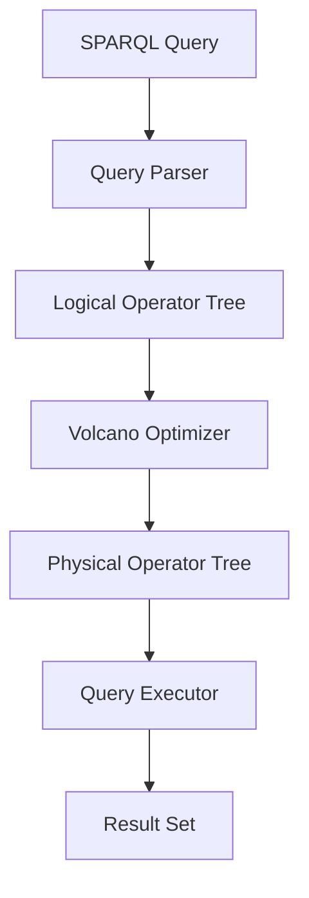

# Optimization

## Table of Contents

1. [Introduction](#introduction)
2. [Logical and Physical Operators](#logical-and-physical-operators)
    - [Logical Operators](#logical-operators)
    - [Physical Operators](#physical-operators)
3. [Volcano Optimizer API](#volcano-optimizer-api)
4. [Mermaid Diagram: Query Optimization Workflow](#mermaid-diagram-query-optimization-workflow)
5. [Appendices](#appendices)
    - [Glossary](#glossary)
    - [Further Reading](#further-reading)

---

## Introduction

Efficient query planning and optimization are pivotal to the performance and scalability of the Kolibrie Database Engine. This chapter outlines the architecture and APIs that facilitate the transformation of high-level SPARQL queries into optimized execution plans, ensuring rapid and resource-efficient data retrieval.

### Logical and Physical Operators

The engine differentiates between **logical operators** and **physical operators** to abstract query semantics from execution strategies. This separation allows for sophisticated optimization techniques and flexibility in execution methods.

#### Logical Operators

Logical operators represent the abstract, high-level operations defined by the SPARQL query. They encapsulate the intent of the query without specifying how the operations are to be physically executed.

**Enum: `LogicalOperator`**

- **Variants:**
    - `Scan`: Initiates the retrieval of triples matching a specific pattern.
    - `Selection`: Applies a condition to filter the results of a preceding operator.
    - `Projection`: Selects specific variables from the result set.
    - `Join`: Combines two result sets based on common variables.

**Structs:**

- **`TriplePattern`**
    - **Fields:**
        - `subject: Option<String>`: The subject component of the pattern, which can be a variable or a constant.
        - `predicate: Option<String>`: The predicate component, similarly variable or constant.
        - `object: Option<String>`: The object component, variable or constant.

- **`Condition`**
    - **Fields:**
        - `variable: String`: The variable to which the condition is applied.
        - `operator: String`: The comparison operator (e.g., `=`, `>`, `<`).
        - `value: String`: The value against which the variable is compared.

**Usage Example:**

A `Selection` operator applies a `Condition` to filter triples where the `?age` variable is greater than `30`.

#### Physical Operators

Physical operators define the concrete methods and strategies used to execute the operations represented by logical operators. They specify how data is accessed, manipulated, and combined.

**Enum: `PhysicalOperator`**

- **Variants:**
    - `TableScan`: Performs a full scan of the triple store to find matching triples.
    - `IndexScan`: Utilizes specific indexes to retrieve triples more efficiently.
    - `Filter`: Applies a condition to filter the results of a preceding operator.
    - `HashJoin`: Implements a hash-based join strategy for combining result sets.
    - `NestedLoopJoin`: Implements a nested loop join strategy.
    - `ParallelJoin`: Performs join operations in parallel for enhanced performance.
    - `Projection`: Extracts specified variables from the result set.

**API Overview:**

- **Execution Method:**
    - `fn execute(&self, database: &mut SparqlDatabase) -> Vec<BTreeMap<String, String>>`: Executes the physical operator against the provided database and returns the results as a vector of variable bindings.

- **Specialized Scan Methods:**
    - `fn execute_table_scan(&self, database: &SparqlDatabase, pattern: &TriplePattern) -> Vec<BTreeMap<String, String>>`: Executes a table scan based on the triple pattern.
    - `fn execute_index_scan(&self, database: &mut SparqlDatabase, pattern: &TriplePattern) -> Vec<BTreeMap<String, String>>`: Executes an index scan leveraging available indexes.

- **Join Execution Methods:**
    - `fn execute_hash_join(&self, left_results: Vec<BTreeMap<String, String>>, right_results: Vec<BTreeMap<String, String>>) -> Vec<BTreeMap<String, String>>`: Executes a hash-based join between two result sets.
    - `fn execute_nested_loop_join(&self, left_results: Vec<BTreeMap<String, String>>, right_results: Vec<BTreeMap<String, String>>) -> Vec<BTreeMap<String, String>>`: Executes a nested loop join between two result sets.
    - `fn execute_parallel_join(&self, left: &PhysicalOperator, right: &PhysicalOperator, database: &mut SparqlDatabase) -> Vec<BTreeMap<String, String>>`: Executes a parallel join using SIMD optimizations.

- **Helper Method:**
    - `fn can_join(&self, left_result: &BTreeMap<String, String>, right_result: &BTreeMap<String, String>) -> bool`: Determines whether two result rows can be joined based on common variable bindings.

**Usage Example:**

A `HashJoin` operator combines two result sets based on the common variable `?person`.

### Volcano Optimizer API

The **Volcano Optimizer** is a cost-based query optimizer inspired by the Volcano project. It systematically explores different physical execution plans for a given logical query, estimates their costs, and selects the most efficient one based on predefined cost metrics.

**Struct: `VolcanoOptimizer`**

- **Fields:**
    - `memo: HashMap<String, PhysicalOperator>`: Caches the best physical operator plans for logical operator subtrees to avoid redundant computations.
    - `selected_variables: Vec<String>`: The variables specified in the `SELECT` clause of the query.
    - `stats: DatabaseStats`: Statistical information about the database, such as total triples and predicate cardinalities, used for cost estimation.

**Struct: `DatabaseStats`**

- **Fields:**
    - `total_triples: u64`: The total number of triples in the database.
    - `predicate_cardinalities: HashMap<String, u64>`: A mapping from predicates to the number of triples that use them, aiding in selectivity estimations.

**Methods:**

- **Initialization:**
    - `fn new(database: &SparqlDatabase) -> Self`: Initializes a new optimizer with gathered statistics from the database.

- **Plan Finding:**
    - `fn find_best_plan(&mut self, logical_plan: &LogicalOperator) -> PhysicalOperator`: Determines the best physical execution plan for the given logical plan.
    - `fn find_best_plan_recursive(&mut self, logical_plan: &LogicalOperator) -> PhysicalOperator`: Recursively explores and selects the most cost-effective physical plan.

- **Cost Estimation:**
    - `fn estimate_cost(&self, plan: &PhysicalOperator) -> u64`: Estimates the cost of executing a given physical operator.
    - `fn estimate_cardinality(&self, pattern: &TriplePattern) -> u64`: Estimates the number of triples that match a given pattern.
    - `fn estimate_selectivity(&self, condition: &Condition) -> f64`: Estimates the selectivity of a filter condition.
    - `fn estimate_output_cardinality(&self, plan: &PhysicalOperator) -> u64`: Estimates the cardinality of the output from a physical operator.

**Usage Workflow:**

1. **Initialization:**
    - Create an instance of `VolcanoOptimizer` by passing a reference to the `SparqlDatabase`.
    - The optimizer gathers statistical data necessary for cost estimations.

2. **Plan Generation:**
    - Invoke `find_best_plan` with the root of the logical operator tree.
    - The optimizer explores various physical operator combinations, estimates their costs, and selects the most efficient plan.

3. **Execution:**
    - The selected physical operator tree is then executed to retrieve query results.

**Example Scenario:**

For a query that retrieves all persons named "Alice":

1. **Logical Plan:**
    - `Scan` operator for triples with predicate `<http://xmlns.com/foaf/0.1/name>` and object `"Alice"`.
    - `Projection` operator to select the `?person` variable.

2. **Optimizer Execution:**
    - The optimizer considers both `TableScan` and `IndexScan` for the `Scan` operator.
    - Based on predicate cardinality and cost factors, it selects the most efficient scan method.
    - The final physical plan is executed to retrieve the results.

### Mermaid Diagram: Query Optimization Workflow

Below is a Mermaid diagram illustrating the workflow from parsing a SPARQL query to optimizing and executing it using the Volcano Optimizer.

*Figure: Query Optimization and Execution Workflow*

---

## Appendices

### Glossary

- **RDF (Resource Description Framework)**: A standard model for data interchange on the web, representing information as triples.
- **SPARQL**: A query language and protocol for RDF, enabling complex queries across diverse data sources.
- **Triple**: The fundamental unit of RDF data, comprising a subject, predicate, and object.
- **Dictionary Encoding**: A mechanism to map string terms to unique numerical identifiers for efficient storage and comparison.
- **Indexing**: The process of creating data structures that allow for quick retrieval of information based on specific keys.
- **SIMD (Single Instruction, Multiple Data)**: A parallel computing method that performs the same operation on multiple data points simultaneously.
- **Rayon**: A Rust library for data parallelism, simplifying the execution of operations across multiple threads.
- **CUDA**: A parallel computing platform and API model created by NVIDIA, allowing for general-purpose computing on GPUs.
- **Volcano Optimizer**: A cost-based query optimizer that explores and selects the most efficient physical execution plan for a given logical query.
- **Logical Operator**: An abstract representation of query operations that define the intent without specifying execution strategies.
- **Physical Operator**: A concrete implementation of a query operation, detailing how it is executed against the data.

### Further Reading

- [SPARQL Query Language for RDF](https://www.w3.org/TR/sparql11-query/)
- [Nom: Parser Combinator Framework](https://github.com/Geal/nom)
- [Rayon: Data Parallelism in Rust](https://github.com/rayon-rs/rayon)
- [SIMD Programming in Rust](https://doc.rust-lang.org/std/simd/)
- [CUDA Programming Guide](https://docs.nvidia.com/cuda/cuda-c-programming-guide/index.html)
- [The Volcano Optimizer: A Practical Query Optimizer for Relational Databases](https://www.cs.toronto.edu/~rgrosse/courses/csc458-s12/readings/volcano.pdf)
