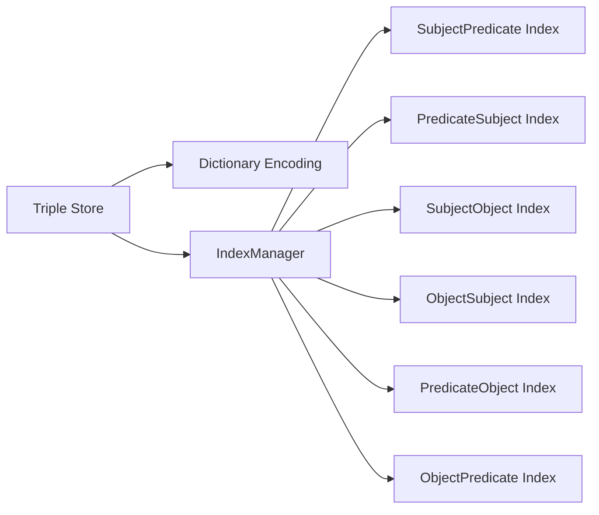
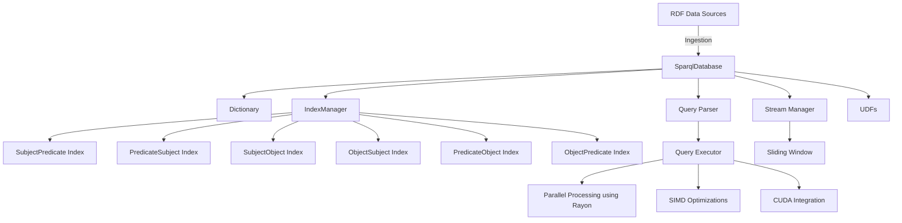
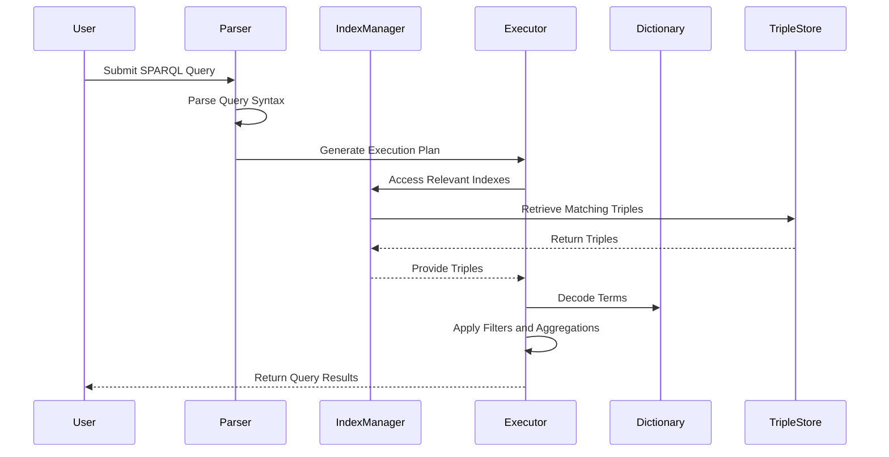

# Kolibrie Database

## Table of Contents

1. [Introduction](#introduction)
2. [System Architecture](#system-architecture)
3. [Data Structures and Indexing Mechanisms](#data-structures-and-indexing-mechanisms)
    - [Triple Representation](#triple-representation)
    - [Dictionary Encoding](#dictionary-encoding)
    - [Index Types and Management](#index-types-and-management)
    - [Indexing Architecture](#indexing-architecture)
4. [Query Parsing and Execution](#query-parsing-and-execution)
    - [Parsing with Nom](#parsing-with-nom)
    - [Handling SPARQL Clauses](#handling-sparql-clauses)
    - [Parallelism and SIMD Optimizations](#parallelism-and-simd-optimizations)
5. [Data Ingestion and Streaming](#data-ingestion-and-streaming)
    - [Parsing RDF/XML](#parsing-rdfxml)
    - [Parsing Turtle and N3 Formats](#parsing-turtle-and-n3-formats)
    - [Stream Management and Sliding Windows](#stream-management-and-sliding-windows)
6. [User-Defined Functions (UDFs)](#user-defined-functions-udfs)
    - [Registering UDFs](#registering-udfs)
    - [Utilizing UDFs in Queries](#utilizing-udfs-in-queries)
7. [Policies and Windowing Mechanisms](#policies-and-windowing-mechanisms)
    - [Window Close Policy](#window-close-policy)
    - [Content Change Policy](#content-change-policy)
    - [Non-Empty Content Policy](#non-empty-content-policy)
    - [Periodic Policy](#periodic-policy)
8. [Performance Optimizations](#performance-optimizations)
    - [Parallel Processing with Rayon](#parallel-processing-with-rayon)
    - [SIMD Enhancements](#simd-enhancements)
    - [CUDA Integration for Hash Joins](#cuda-integration-for-hash-joins)
9. [Example Usage](#example-usage)
    - [Sample SPARQL Queries](#sample-sparql-queries)
    - [Step-by-Step Query Execution](#step-by-step-query-execution)
10. [Diagrams](#diagrams)
    - [System Architecture Diagram](#system-architecture-diagram)
    - [Query Execution Flow](#query-execution-flow)
11. [Appendices](#appendices)
    - [Glossary](#glossary)
    - [Further Reading](#further-reading)

---

## Introduction

Welcome to the comprehensive documentation of the **Kolibrie Database Engine**, a high-performance, scalable, and extensible system designed to manage and query RDF (Resource Description Framework) data using the SPARQL query language. This documentation aims to provide an in-depth understanding of the engine's architecture, data structures, indexing mechanisms, query parsing, execution strategies, and performance optimizations. Whether you are a database architect, a software developer, or an academic researcher, this guide will equip you with the knowledge required to effectively utilize and extend the database engine.

---

## System Architecture

The Kolibrie Database Engine is architected to efficiently handle large-scale RDF data, enabling rapid query processing and seamless data ingestion. The system is modular, comprising several interconnected components that work in harmony to provide robust data management and querying capabilities.

### Core Components

1. **Triple Store**: The foundational storage mechanism that holds RDF triples (subject-predicate-object).
2. **Dictionary**: A bidirectional mapping system that encodes and decodes string terms to compact numerical representations, optimizing storage and comparison operations.
3. **Index Manager**: Manages multiple indexes to accelerate query processing by providing quick access paths to triples based on different index types.
4. **Query Parser**: Utilizes the Nom parsing library to interpret and validate SPARQL queries, transforming them into executable plans.
5. **Query Executor**: Executes parsed queries using optimized algorithms, leveraging parallelism and SIMD instructions for enhanced performance.
6. **User-Defined Functions (UDFs)**: Allows the extension of query capabilities by enabling custom functions to be integrated into the query processing pipeline.
7. **Stream Manager**: Handles real-time data ingestion and sliding window mechanisms to support dynamic data scenarios.

### Interaction Between Components

The system operates in a pipeline fashion:

1. **Data Ingestion**: RDF data is parsed (from formats like RDF/XML, Turtle, N3) and stored in the Triple Store, with terms encoded via the Dictionary.
2. **Indexing**: As triples are stored, the Index Manager updates various indexes to facilitate efficient querying.
3. **Query Parsing**: SPARQL queries are parsed into an abstract syntax tree, identifying clauses, patterns, filters, and aggregations.
4. **Query Execution**: The Query Executor utilizes indexes and optimized algorithms to retrieve and process relevant triples, applying filters and aggregations as specified.
5. **Results**: The final query results are decoded from their numerical representations back into human-readable forms.

---

## Data Structures and Indexing Mechanisms

Efficient data structures and robust indexing mechanisms are pivotal to the performance of the database engine. This section delves into the primary data structures used and the indexing strategies employed to optimize query operations.

### Triple Representation

In RDF, data is represented as triples, each consisting of a **subject**, **predicate**, and **object**. Internally, the database engine represents these triples using the `Triple` struct:

```rust
#[derive(Debug, Clone, PartialEq, Eq, Ord, PartialOrd, Hash)]
pub struct Triple {
    pub subject: u32,
    pub predicate: u32,
    pub object: u32,
}
```

- **Subject (`u32`)**: Encoded identifier representing the subject entity.
- **Predicate (`u32`)**: Encoded identifier representing the relationship or property.
- **Object (`u32`)**: Encoded identifier representing the target entity or literal value.

### Dictionary Encoding

To optimize storage and accelerate comparisons, the engine employs a `Dictionary` that encodes string terms into unique numerical identifiers (`u32`). This bidirectional mapping ensures that common terms are stored efficiently and allows rapid retrieval during query processing.

### Index Types and Management

The database engine maintains multiple indexes to support diverse query patterns. Each index type represents a different ordering of the triple components, enabling efficient access based on varying query requirements.

#### IndexType Enum

```rust
#[derive(Debug, Clone, Copy, PartialEq, Eq, Hash)]
pub enum IndexType {
    SubjectPredicate,
    PredicateSubject,
    SubjectObject,
    ObjectSubject,
    PredicateObject,
    ObjectPredicate,
}
```

Each variant specifies a unique ordering of the triple components, facilitating different access paths:

- **SubjectPredicate (`S-P`)**: `(subject, predicate) → [object]`
- **PredicateSubject (`P-S`)**: `(predicate, subject) → [object]`
- **SubjectObject (`S-O`)**: `(subject, object) → [predicate]`
- **ObjectSubject (`O-S`)**: `(object, subject) → [predicate]`
- **PredicateObject (`P-O`)**: `(predicate, object) → [subject]`
- **ObjectPredicate (`O-P`)**: `(object, predicate) → [subject]`

#### TripleIndex Struct

```rust
#[derive(Debug, Clone)]
pub struct TripleIndex {
    pub index: BTreeMap<(u32, u32), Vec<u32>>,
    pub index_type: IndexType,
}
```

Each `TripleIndex` encapsulates:

- **index**: A `BTreeMap` mapping a pair of encoded terms to a list of corresponding encoded values.
- **index_type**: The type of index, as defined by `IndexType`.

#### IndexManager Struct

```rust
#[derive(Debug, Clone)]
pub struct IndexManager {
    indexes: HashMap<IndexType, TripleIndex>,
}
```

The `IndexManager` maintains a collection of `TripleIndex` instances, one for each `IndexType`. It centralizes all indexing logic, allowing efficient delegation from other components like `SparqlDatabase`.

#### Indexing Operations

Key operations facilitated by the `IndexManager` include:

- **Initialization**: Creating an empty `TripleIndex` for each `IndexType`.
- **Insertion**: Adding a new triple to all relevant indexes.
- **Retrieval**: Accessing specific indexes based on query requirements.
- **Optimization**: Sorting and deduplicating index values to enhance query efficiency.

### Indexing Architecture

Below is a Mermaid diagram illustrating the indexing architecture within the database engine.



*Figure: High-Level Indexing Architecture*

---

## Query Parsing and Execution

Efficient query parsing and execution are essential for delivering swift and accurate responses to SPARQL queries. This section explores the mechanisms employed by the database engine to parse, interpret, and execute queries.

### Parsing with Nom

The engine leverages the **Nom** parsing library, a powerful parser combinator framework in Rust, to interpret SPARQL query strings. Nom facilitates the construction of parsers that can handle complex grammars efficiently.

#### Key Parsing Functions

- **Identifier Parsing**: Recognizes valid identifiers, including prefixed names.
- **Literal Parsing**: Handles string literals enclosed in double quotes.
- **URI Parsing**: Extracts URIs encapsulated within angle brackets.
- **Clause Parsing**: Parses various SPARQL clauses such as `SELECT`, `WHERE`, `FILTER`, `BIND`, and `VALUES`.

### Handling SPARQL Clauses

The engine supports a comprehensive subset of SPARQL features, enabling the execution of complex queries.

#### SELECT Clause

The `SELECT` clause specifies the variables or aggregate functions to retrieve. The parser distinguishes between simple variable selections and aggregate operations like `SUM`, `MIN`, `MAX`, and `AVG`.

#### WHERE Clause

The `WHERE` clause contains triple patterns, filters, and other constraints that define the query's scope. The parser interprets these patterns, translating them into executable plans that interact with the indexed data.

#### FILTER Clause

`FILTER` clauses impose additional constraints on query results, enabling conditional retrieval based on specified criteria.

#### BIND Clause

`BIND` clauses allow the creation of new variables based on expressions or user-defined functions, enhancing query flexibility.

#### VALUES Clause

The `VALUES` clause provides inline data for variables, facilitating the inclusion of specific value sets within queries.

### Parallelism and SIMD Optimizations

To maximize performance, the query executor employs parallel processing and SIMD (Single Instruction, Multiple Data) instructions, leveraging modern CPU architectures for concurrent and vectorized operations.

- **Rayon**: Utilized for data parallelism, enabling the execution of operations across multiple threads seamlessly.
- **SIMD Instructions**: Employed for accelerating data comparisons and aggregations, reducing processing time for large datasets.

---

## Data Ingestion and Streaming

Efficient data ingestion is critical for maintaining an up-to-date and comprehensive triple store. The engine supports parsing multiple RDF serialization formats and managing real-time data streams.

### Parsing RDF/XML

The `parse_rdf_from_file` method handles the ingestion of RDF data in XML format. It utilizes an XML reader to parse RDF triples, supports prefix declarations, and employs parallel processing for bulk data handling.

### Parsing Turtle and N3 Formats

The engine also supports Turtle and Notation3 (N3) formats through dedicated parsing methods (`parse_turtle` and `parse_n3`). These parsers handle syntax specific to their formats, including prefix declarations and inline literals.

### Stream Management and Sliding Windows

Real-time data scenarios are managed through streams and sliding windows:

- **Streams**: Represent sequences of timestamped triples, enabling temporal queries and real-time data analysis.
- **Sliding Windows**: Facilitate the management of data subsets over specified time intervals, supporting dynamic query operations that adapt to changing data streams.

---

## User-Defined Functions (UDFs)

The engine's extensibility is enhanced through support for User-Defined Functions (UDFs), allowing custom operations to be integrated into query processing.

### Registering UDFs

UDFs are registered via the `register_udf` method, which associates a function name with a closure that implements the desired functionality. These functions can then be invoked within `BIND` clauses to perform custom transformations or computations.

### Utilizing UDFs in Queries

Once registered, UDFs can be employed within `BIND` clauses to manipulate query results dynamically. For example, a `CONCAT` function can merge multiple variables or literals into a single string variable within the query result set.

---

## Policies and Windowing Mechanisms

The engine incorporates various policies to manage data within sliding windows effectively, ensuring that query results reflect the most relevant and recent data.

### Window Close Policy

Triggers the evaluation of the sliding window when it reaches its specified width, ensuring that outdated data is excluded from query results.

### Content Change Policy

Monitors changes in the content of the sliding window, initiating evaluations when modifications are detected to maintain accurate query outcomes.

### Non-Empty Content Policy

Ensures that evaluations are only performed when the sliding window contains data, avoiding unnecessary computations on empty datasets.

### Periodic Policy

Schedules evaluations of the sliding window at regular intervals, maintaining consistency in query result updates over time.

---

## Performance Optimizations

To achieve high performance, the database engine incorporates several optimization strategies, leveraging both software and hardware capabilities.

### Parallel Processing with Rayon

**Rayon** is employed to distribute computational tasks across multiple CPU cores, enabling concurrent processing of data chunks. This parallelism significantly reduces query execution times, especially for large datasets.

### SIMD Enhancements

Single Instruction, Multiple Data (SIMD) instructions are utilized to perform vectorized operations on data, accelerating tasks like string comparisons and numerical aggregations. The engine's implementation ensures that these optimizations are safely and efficiently integrated within the Rust codebase.

### CUDA Integration for Hash Joins

For advanced performance, the engine provides integration with CUDA-enabled GPUs to perform hash joins, a critical operation in query execution. This GPU acceleration further enhances the system's ability to handle complex and large-scale queries with minimal latency.

---

## Example Usage

This section demonstrates the practical application of the database engine through sample SPARQL queries and their step-by-step execution within the system.

### Sample SPARQL Queries

#### 1. Basic Triple Pattern

```sql
SELECT ?s ?p ?o
WHERE {
    ?s ?p ?o .
}
```

**Description**: Retrieves all triples in the database, selecting subject (`?s`), predicate (`?p`), and object (`?o`).

#### 2. Filtered Query

```sql
SELECT ?person ?name
WHERE {
    ?person <http://xmlns.com/foaf/0.1/name> ?name .
    FILTER (?name = "Alice")
}
```

**Description**: Selects individuals (`?person`) with the name "Alice".

#### 3. Aggregation with Group By

```sql
SELECT (COUNT(?o) AS ?count)
WHERE {
    ?s <http://example.org/predicate> ?o .
}
GROUP BY ?s
```

**Description**: Counts the number of objects (`?o`) associated with each subject (`?s`) for a specific predicate.

#### 4. Using BIND with CONCAT

```sql
SELECT ?s ?concatName
WHERE {
    ?s <http://xmlns.com/foaf/0.1/firstName> ?firstName .
    ?s <http://xmlns.com/foaf/0.1/lastName> ?lastName .
    BIND(CONCAT(?firstName, " ", ?lastName) AS ?concatName)
}
```

**Description**: Concatenates first and last names into a single variable (`?concatName`).

### Step-by-Step Query Execution

Let's walk through the execution of the second sample query:

```sql
SELECT ?person ?name
WHERE {
    ?person <http://xmlns.com/foaf/0.1/name> ?name .
    FILTER (?name = "Alice")
}
```

**Execution Steps**:

1. **Parsing**:
    - The `SELECT` clause identifies `?person` and `?name` as the variables to retrieve.
    - The `WHERE` clause contains a triple pattern and a `FILTER` condition.
    - The parser translates the triple pattern into an internal representation, resolving the predicate URI.

2. **Query Planning**:
    - The `IndexManager` utilizes the `PredicateSubject` index (`P-S`) to locate all triples with the predicate `<http://xmlns.com/foaf/0.1/name>`.
    - Subjects (`?person`) and objects (`?name`) are extracted from these triples.

3. **Filtering**:
    - The `FILTER` clause applies a condition to retain only those triples where the object (`?name`) equals "Alice".
    - SIMD optimizations accelerate the comparison operation across multiple triples.

4. **Result Compilation**:
    - The filtered results are decoded from their numerical representations back into their original string forms.
    - The final result set includes pairs of `?person` and `?name` where the name is "Alice".

5. **Output**:
    - The query returns the list of individuals named Alice, along with their corresponding URIs.

---

## Diagrams

Visual representations aid in comprehending the complex interactions within the database engine. Below are key diagrams illustrating the system's architecture and query execution flow.

### System Architecture Diagram



*Figure: Comprehensive System Architecture*

### Query Execution Flow



*Figure: SPARQL Query Execution Flow*

---

## Appendices

### Glossary

- **RDF (Resource Description Framework)**: A standard model for data interchange on the web, representing information as triples.
- **SPARQL**: A query language and protocol for RDF, enabling complex queries across diverse data sources.
- **Triple**: The fundamental unit of RDF data, comprising a subject, predicate, and object.
- **Dictionary Encoding**: A mechanism to map string terms to unique numerical identifiers for efficient storage and comparison.
- **Indexing**: The process of creating data structures that allow for quick retrieval of information based on specific keys.
- **SIMD (Single Instruction, Multiple Data)**: A parallel computing method that performs the same operation on multiple data points simultaneously.
- **Rayon**: A Rust library for data parallelism, simplifying the execution of operations across multiple threads.
- **CUDA**: A parallel computing platform and API model created by NVIDIA, allowing for general-purpose computing on GPUs.

### Further Reading

- [SPARQL Query Language for RDF](https://www.w3.org/TR/sparql11-query/)
- [Nom: Parser Combinator Framework](https://github.com/Geal/nom)
- [Rayon: Data Parallelism in Rust](https://github.com/rayon-rs/rayon)
- [SIMD Programming in Rust](https://doc.rust-lang.org/std/simd/)
- [CUDA Programming Guide](https://docs.nvidia.com/cuda/cuda-c-programming-guide/index.html)